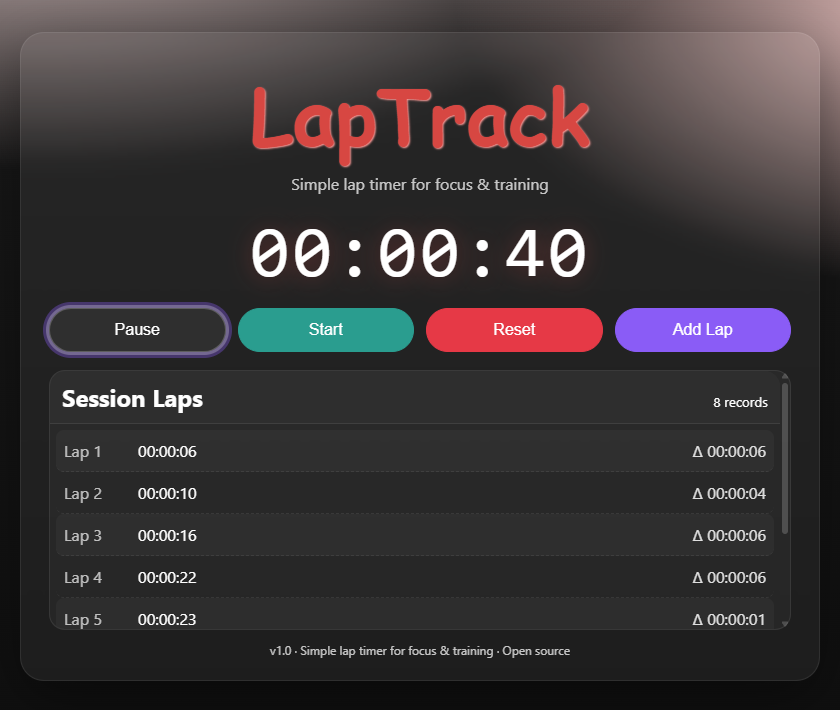

# LapTrack ⏱ (React)

[](https://<your-username>.github.io/laptrack)


A simple **lap timer web app**. Built with **React + CSS** — start, stop, reset, and record laps with differences.  
👉 **Live demo:** [https://laptrack.netlify.app](https://laptrack.netlify.app)

---

## Highlights

- Start / Stop / Reset stopwatch controls
- Guard: prevent multiple Start clicks while running
- 🚀 Split/Lap: record lap times with Δ diff
- 🚀 Custom UI: glassmorphism card, big digits, sticky laps table
- 🚀 Keyboard shortcuts: **Space = Start/Pause, R = Reset, L = Add Lap**

---

## Screenshot



---

## What I learned

- Using **custom React hooks** (`useTimer`) to encapsulate logic.
- Managing refs vs state (`useRef` for DOM, `useState` for UI).
- Formatting time into `HH:MM:SS`.
- Styling with CSS glassmorphism + sticky headers.
- Organizing code into small, reusable files.

---

## Project structure

```
/ # project root
├── src/
│ ├── App.js # UI shell, controls, render laps
│ ├── useTimer.js # stopwatch logic (time, laps, start/stop/reset/split)
│ ├── formatTime.js # format seconds → HH:MM:SS
│ ├── index.css # layout, glass card, controls, laps, footer
│ └── index.js # entry point
├── public/
│ └── index.html # page title "LapTrack"
├── docs/
│ └── screenshot.png # UI screenshot
├── package.json
├── README.md
└── LICENSE
```

---

## Run locally

1. Clone repo:
   ```bash
   git clone https://github.com/kiettt23/react-timer-app.git
   cd laptrack
   ```
2. Install & run:
   ```bash
   npm install
   npm start
   ```

---

## Roadmap

- [ ] Countdown mode
- [ ] Pomodoro cycles (25-5)
- [x] Keyboard shortcuts (Space=Start/Stop, R=Reset, L=Lap)
- [ ] Save sessions (localStorage)
- [ ] Export laps to CSV/JSON
- [ ] Theme switch (dark/light)
- [ ] (Sport mode) Pace/km, charts

---

## License

MIT — see [LICENSE](./LICENSE).
